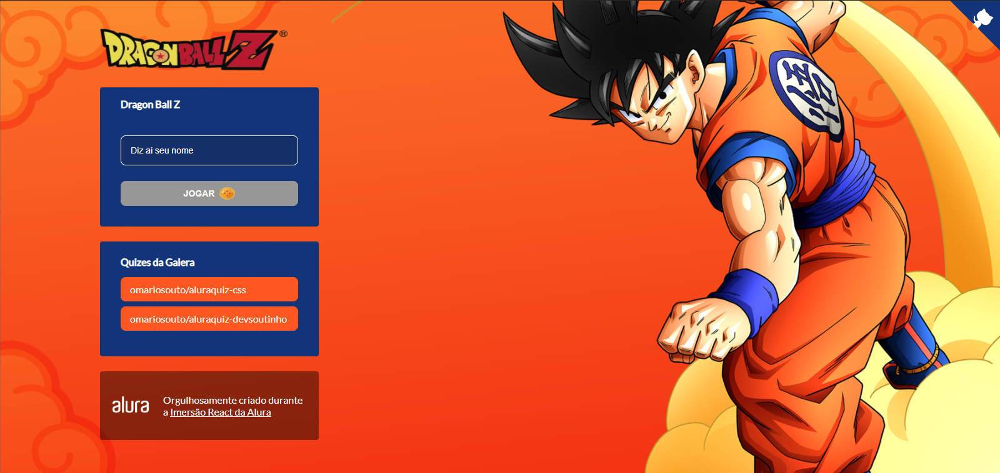

<h3 align="justify">
Aluraquiz é um projeto Open Source desenvolvido na semana Imersão React (2.0) da Alura utilizando as tecnologias **React e Nextjs.

</h3>

<div align="center">
	
</div>

## :hammer_and_wrench: Ferramentas

-   [Yarn](https://yarnpkg.com/)
-   [Nextjs](https://nextjs.org/)
-   [Styled Components](https://styled-components.com)
-   [Vercel](https://vercel.com)

## :rocket: Executando o projeto

```bash
yarn dev
```

## **:star2: AGRADECIMENTOS**

<div align=center>

<table style="width:100%">
  <tr align=center>
    <th><strong>Alura</strong></th>
    <th><strong>Mario Souto</strong></th>
    <th><strong>Juliana Amoasei</strong></th>
    <th><strong>Paulo Silveira</strong></th>
  </tr>
  <tr align=center>
    <td>
      <a href="https://www.alura.com.br//">
        
      </a>
    </td>
    <td>
      <a href="https://github.com/omariosouto">
        
      </a>
    </td>
    <td>
      <a href="https://github.com/JulianaAmoasei">
        
      </a>
    </td>
    <td>
      <a href="https://www.linkedin.com/in/paulosilveira/">
        
      </a>
    </td>
  </tr>
</table>

</div>

<h3 align="center">
  Feito por 
  <a href="https://www.linkedin.com/in/manobrega/">Matheus Nobrega<a>
</h3>
